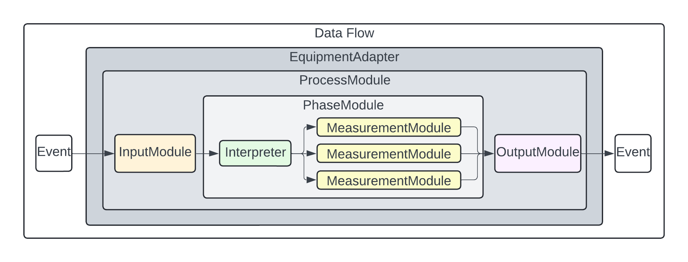

# Adapter Framework for Equipment Monitoring and Control

## Overview

This tool implements a modular and scalable **Adapter Architecture** designed for monitoring and controlling various types of equipment (e.g., bioreactors). While the **EquipmentAdapter** is the primary adapter, the rest of the system is composed of **modules** (ProcessModules, PhaseModules, etc.) that work together to perform specific tasks such as event monitoring, data processing, and output transmission.

---

## For Users

The **Users** section is for those who want to use **existing EquipmentAdapters** to integrate and monitor equipment without creating new modules.

### Getting Started

1. **Clone the Repository**:
    ```bash
    git clone https://gitlab.com/LabEquipmentAdapterFramework/leaf/-/tree/main?ref_type=heads
    cd leaf
    ```

2. **Install Dependencies**:
    ```bash
    pip install -r requirements.txt
    ```

3. **Run Pre-built EquipmentAdapters**:
   The framework includes a set of pre-built EquipmentAdapters for common equipment types, such as bioreactors, fermenters, etc. Configure and run them with minimal setup.

4. **Configuration**:
   - Modify configuration parameters such as input/output settings (e.g., file paths, MQTT connections) as needed without writing custom code.

---

## For Developers

The **Developers** section is for those who want to extend the framework by building new **EquipmentAdapters** or customising the **modules** within them.

### Adapter Architecture

The system’s design follows a modular, reusable structure, where only the **EquipmentAdapter** are composed of modules and an interpreter. The **modules** are used to compose the EquipmentAdapter. This modular design allows developers to create EquipmentAdapters by nesting and connecting existing modules.

**Figure 1: Data Flow**  
*This figure illustrates the high-level input/output data flow for EquipmentAdapters.*



---

### Adapter Composition and Class Hierarchy

The **EquipmentAdapter** uses several types of **modules** (ProcessModules, PhaseModules, InputModules, OutputModules, and MeasurementModules) to handle different functionalities. The EquipmentAdapter itself is the primary container that manages how these modules interact.

**Figure 2: Structure**  
*This figure shows how different types of modules are composed to form an EquipmentAdapter.*


---

### Initialisation Process

When the EquipmentAdapter starts, it initialises its modules (such as process and phase modules) and sets up the required input/output mechanisms. Initialisation typically involves linking the modules to specific equipment, setting up event watchers, and preparing for data collection or control actions.

**Figure 3: Initialisation**  
*This figure illustrates how the modules are initialised during the setup of an EquipmentAdapter.*


---

### Starting and Running EquipmentAdapters

When an EquipmentAdapter starts, it begins monitoring for events, processing data, and passing it through the necessary modules, such as transformation or output. This involves using **EventWatcherModules** to monitor changes (e.g., file updates or API responses), transforming measurements (if required), and sending the final data output to a defined destination.

**Figure 4: Start Process**  
*This figure shows the actions that take place when an EquipmentAdapter starts running.*


---

### Handling Events

Once the system is running, **EventWatcherModules** detect events, and these events trigger actions defined in the **ProcessModules** and **PhaseModules**. Each event is processed, and the associated data is transformed (if necessary) and outputted. The sequence of event detection, data transformation, and output is central to the framework’s operation.

**Figure 5: Event Handling**  
*This figure details the flow of actions when an event occurs in the system.*


---

### Key Components

#### EquipmentAdapter
The **EquipmentAdapter** is the central component that contains all other modules and manages the interaction between processes, events, and outputs for a specific piece of equipment.

#### ProcessModule
**ProcessModules** manage different processes within the equipment. These processes may include start, measurement, and stop phases.

#### PhaseModule
**PhaseModules** handle distinct phases within a process and ensure the correct sequence of actions is followed. They may trigger measurements, control actions, or data output during the running of a process.

#### EventWatcherModule
**EventWatcherModules** detect specific events from equipment (e.g., file changes or API events) and trigger the corresponding phase or process actions.

#### MeasurementModule
**MeasurementModules** transform raw equipment data into a standardised format using predefined terms and units.

#### OutputModule
**OutputModules** transmit the transformed data to external systems (e.g., MQTT, databases).

---

## Example Data Flow

1. **Event Detection**: The EventWatcherModule detects an event (e.g., a file is updated).
2. **Data Processing**: The data is passed to the appropriate MeasurementModule for standardisation (if required).
3. **Data Output**: The processed data is sent via an OutputModule to the external system (e.g., MQTT).

## License

This project is licensed under the MIT License - see the LICENSE file for details.
