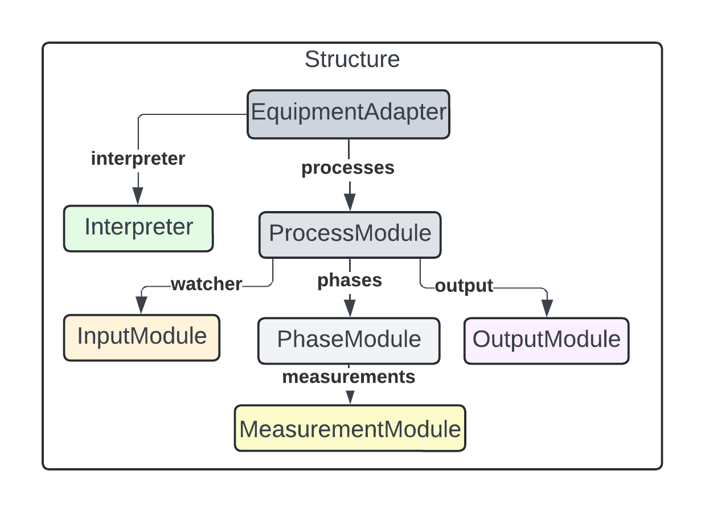

# Adapter Framework for Equipment Monitoring and Control

## Overview
The Lab Equipment Adapter Framework (LEAF) implements an **Adapter Architecture**  designed to monitor and control various equipment types (e.g., bioreactors). The core principle of LEAF is to reduce the barrier to entry as much as possible to develop and deploy adapters for new equipment. The **EquipmentAdapters** are the functional equipment monitors composed of the rest of the **modules** (ProcessModules, PhaseModules, etc.) that perform specific tasks such as event monitoring, data processing, and output transmission.
---

## For Users

The **Users** section is for those who want to use **existing EquipmentAdapters** to integrate and monitor equipment without creating new modules.

### Getting Started

1. **Install LEAF**
    ```bash
    python -m pip install git+https://gitlab.com/LabEquipmentAdapterFramework/leaf
    ```

2. **Identify EquipmentAdapter**
The framework includes a set of pre-built equipment adapters for common equipment types, such as bioreactors, fermenters, etc. All previously developed adapters can be explored [here](https://gitlab.com/LabEquipmentAdapterFramework/leaf-adapters).

3. **Install EquipmentAdapter**
Once an adapter is identified, it must be installed in the same way as the LEAF system. The adapter's URL from the repository must be swapped with <adapter_url> below.
    ```bash
    python -m pip install git+<adapter_url>
    ```
4. **Configuration**
Before running the adapter, details on the specific environment must be provided. This is achieved by Modifying the configuration parameters, such as input/output settings (e.g., file paths, MQTT connections), as needed without writing custom code. This configuration is highly specific to the equipment and the environment, and many options exist. Therefore, the specifics are [here](#guidelines-for-defining-configuration). Once a `config.yaml` file has been established, the adapter can be started.

5. **Running EquipmentAdapter**
Once a configuration has been established, the adapter can be executed using the command: 
    ```bash
    python -m leaf.start -c config.yaml
    ```
    If the adapter has been configured correctly, then the adapter should begin running and monitoring the equipment. If an error occurs, the LEAF adapter system uses custom errors to describe what has occurred. It must be noted that the adapter system will not run if an error occurs during initialisation (errors here are likely fatal and are not recoverable). Still, monitoring errors will not stop the adapter as it is designed to be a continuous monitoring tool.

6. **Debugging Adapters**
In some cases, the adapter system may produce errors due to incorrect configuration, genuine fault with the adapter or issue with the equipment. If configuration errors occur, they will be displayed during initialisation, and the program will exit. All of these errors are "AdapterBuildError" errors. These error codes and names are expanded below.
    * *"device.json not found for adapter at ..."*: The adapter chosen doesn't have attached metadata, i.e. device.json in the directory.
    * *"equipment_id' not found in ..."*: The device.json is present but doesn't have an equipment_id.
    * *"Adapter for code ... not found."*: An adapter equipment_id wasn't found with the same code as provided in the configuration file.
    * *"Missing instance ID."*: The configuration file provided doesn't have an instance ID.
    * *"Missing required keys for ..."*: The required parameters for an adapter haven't been provided in full.
    If an error ocurrs during monitoring (usual running of the adapter), the adapter will continue running and attempt to adapt given the type of error. The types of errors are explained below.
    * *InputError*: Either the hardware is down, or the input mechanism cannot access the information it should be able to.
    * *HardwareStalledError*: The hardware appears to have stopped transmitting information.
    * *ClientUnreachableError*: The client OR output mechanism can't post information. For example, the MQTT broker can't be transmitted to.
    * *AdapterLogicError*: Logic within how the adapter has been built causes an error.
    * *InterpreterError*: The adapter interpreter has some faults that cannot be identified without knowledge of the adapter's specifics.
### Guidelines for defining configuration
When using an adapter, unique information about each physical instance is needed. Each piece may have different identifiers, data paths, and settings. The configuration file provides this individual context by bridging the general adapter code with the specific details of each setup. This configuration allows the adapter system to customise its behaviour for each instance, enabling a single adapter class to be reused across multiple pieces of equipment, each with its configuration.
#### Equipment Instances
Each entry under `EQUIPMENT_INSTANCES` represents an individual `EquipmentAdapter` instance for a piece of equipment (A single process can support running multiple adapters). This section provides information necessary to distinguish each instance and configure it according to specific needs:
- equipment:
    - **adapter**: This field specifies the adapter type, which is the equipment ID within the `device.json` file of the given adapter (e.g.,`ConcreteAdapter1`), which is the name of the adapter class. It is needed for adapter discovery. Below, we discuss each aspect of a config file. Due to the config file's specific nature, some examples for specific adapters are given, denoted with the *(EquipmentAdapter specific)* tag.

    - **data**: This field contains identifiers/metadata. It is required for discovery and ensuring uniqueness within the larger network of equipment. If the instance_id is not unique, the program will fail at initialisation.
        - **instance_id**: A unique identifier for this equipment instance.
        - **institute**: The organisation or location where the equipment is based.
    - **requirements**: Defines adapter-specific required operational parameters:
        - **write_file** *(EquipmentAdapter specific)*: Specifies the path where data from the equipment will be written.
        - **broker/host** *(EquipmentAdapter specific)*: Connection information, such as the host address.
        - **port** *(EquipmentAdapter specific)*: The connection port for the host.
        - **token** *(EquipmentAdapter specific)*: Code for authentication.
    - **simulation** *(optional)*: This nested data is only needed if the adapter is wanted to run in simulated mode.
        - **filename**: A path to a file with simulated data (Note this may change for different adapters).
        - **interval**: The interval in seconds when the simulation will feed the adapter another chunk of data (measurement).
    - **maximum_message_size** *(optional)*: If present, it sets the maximum number of measurements that will be transmitted within a single message. The higher this option, the fewer messages will be sent, but each message will be a larger payload.
    - **experiment_timeout** *(optional)*: If present, when an experiment is running, and a new measurement hasn't been taken within this timeout period, the experiment will be stopped. This is used for cases where the lack of measurement data will be due to an error in a given time.
#### Outputs
Each entry under `OUTPUTS` represents an `OutputModule` for transmitting or storing data. Output modules can be chained together through a fallback mechanism, where the next module in the sequence is used if the primary output fails. Like the requirement section within the `EquipmentAdapters`, most of the fields within an OUTPUTS element are specific to the type of module that is defined to be used.
- **plugin**: This specifies the type of output module, e.g., MQTT, KEYDB, or FILE. The name needs to be the same as the `OutputModule` class.
- **broker/host** *(OutputModule specific)*: Connection information, such as the broker or host address for `MQTT` or `KEYDB` outputs.
- **port** *(OutputModule specific)*: The connection port for the output module.
- **username/password** *(OutputModule specific)*: Credentials for authentication (for secure output modules like `MQTT`).
- **fallback**: Defines the next output in the chain if the primary output fails. For example, if both previous outputs fail, an `MQTT` output can fall back to `KEYDB`, which can then fall back to a `FILE` output.
- **filename** *(OutputModule specific)*: Specifies the path to a file where data will be stored locally if other outputs are unavailable.

This structure enables flexible data transmission. Primary outputs can be backed up by secondary methods, ensuring data persistence even if one output method encounters issues. This data must be specified within a file known as a "yaml" file. This is essentially a dictionary of keys and values, as seen below.
````yaml

EQUIPMENT_INSTANCES:
  - equipment:
      adapter: ConcreteAdapter1
      data:
        instance_id: example_equipment_id1
        institute: example_equipment_institute1
      requirements:
        write_file: test/tmp123.csv
  - equipment:
      adapter: ConcreteAdapter1
      data:
        instance_id: example_equipment_id1
        institute: example_equipment_institute1
      requirements:
        write_file: test/tmp.csv
      simulation:
        filename: tests/static_files/biolector1_full.csv
        interval: 10
  - equipment:
      adapter: ConcreteAdapter2
      data:
        instance_id: example_equipment_id3
        institute: example_equipment_institute3
      requirements:
        host: localhost
        port: 9501
        token: c50dcbbd-fa64-4f9c-98f7-85c39d98c3c2
      maximum_message_size: 1
OUTPUTS:
  - plugin: MQTT
    broker: localhost
    port: 1883
    fallback: KEYDB
  - plugin: KEYDB
    host: localhost
    port: 6379
    db: 0
    fallback: FILE
  - plugin: FILE
    filename: local.json
    fallback: null
````
---

## For Developers

The **Developers** section is for those who want to extend the framework by building new **EquipmentAdapters** or customising the **modules** within them.

### Adapter Architecture

The system’s design follows a modular, reusable structure, where only the **EquipmentAdapter** comprises modules and an interpreter. The **modules** are used to compose the EquipmentAdapter. This modular design allows developers to create EquipmentAdapters by nesting and connecting existing modules. Below is a brief description of all of the components of an adapter.
* **EquipmentAdapter** is the central component that contains all other modules and manages the interaction between processes, events, and outputs for a specific piece of equipment.
* **ProcessModules** manage different processes within the equipment. These processes may include start, measurement, and stop phases.
* **PhaseModules** handle distinct phases within a process and ensure the correct sequence of actions is followed. They may trigger measurements, control actions, or data output during the running of a process.
* **EventWatcherModules** detect specific events from equipment (e.g., file changes or API events) and trigger the corresponding phase or process actions.
* **MeasurementModules** transform raw equipment data into a standardised format using predefined terms and units.
* **OutputModules** transmit the transformed data to external systems (e.g., MQTT, databases).

As seen in Figure 1, these components all come together to identify events, take data from the equipment and route them to the correct place via the `ProcessAdapter` and `PhaseAdapter` based on the type of event (start, stop, measurement, etc).

**Figure 1: Data Flow**  
*This figure illustrates the high-level input/output data flow for EquipmentAdapters.*


---

### Adapter Composition and Class Hierarchy

The **EquipmentAdapter** uses several **modules** (ProcessModules, PhaseModules, InputModules, OutputModules, and MeasurementModules) to handle different functionalities. The EquipmentAdapter itself is the primary container that manages how these modules interact.

**Figure 2: Structure**  
*This figure shows how different modules are composed to form an EquipmentAdapter.*



---

### Initialisation Process

When the EquipmentAdapter starts, it initialises its modules (such as process and phase) and sets up the required input/output mechanisms. Initialisation typically involves linking the modules to specific equipment, setting up event watchers, and preparing for data collection or control actions.

**Figure 3: Initialisation**  
*This figure illustrates how the modules are initialised during the setup of an EquipmentAdapter.*


---

### Starting and Running EquipmentAdapters

When an EquipmentAdapter starts, it begins monitoring for events, processing data, and passing it through the necessary modules, such as transformation or output. This involves using **EventWatcherModules** to monitor changes (e.g., file updates or API responses), transforming measurements (if required), and sending the final data output to a defined destination.

**Figure 4: Start Process**  
*This figure shows the actions that take place when an EquipmentAdapter starts running.*


---

### Handling Events
Once the system is running, `EventWatcherModules` detect events, and these events trigger actions defined in the `ProcessModules` and `PhaseModules`. Each event is processed, and the associated data is transformed (if necessary) and outputted. The sequence of event detection, data transformation, and output is central to the framework’s operation. Most adapters will likely inherit from the existing `StartStopAdapter` because they can be contained (even if conceptually) as equipment that performs discrete experiments. However, the routing system, i.e. how events are mapped to topics/actions and then to specific outputs, is a defined and extensible system, which is explained further [here](#leaf-register).

**Figure 5: Event Handling**  
*This figure details the flow of actions when an event occurs in the system.*


---

### Guidelines for Composing an Adapter

#### Overview
Equipment Adapters are containers of modules (and an interpreter) that, when joined, can take new information from equipment, transform it into a standard structure, and output or store it. By design, a new adapter is composed of reusing existing modules, and unlike developing interpreters, the process is more deterministic. At this point, it is assumed how adapters are structured and run as described in the [For Developer](#for-developers) section. This document provides guidelines for composing an adapter from existing components. It must be noted and seen within Figure 5 that intermediate generic adapters such as the `StartStopAdapter` exist, which makes composing similar adapters trivial as connecting input events to topics is not required. However, for completeness in this example, an adapter will inherit from the base class (`EquipmentAdapter`) to provide an end-end example of what is needed.

**Figure 5: Hierarchy**  
*This figure displays the hierarchy of adapters. All adapters are derived from the original `EquipmentAdapter`, but intermediate adapters are available for common processes. For example, `StartStopAdapter` is an adapter that implements the process for discrete experiments (Experiments that have defined starts and ends).*


---

#### Requirements
1. **EquipmentAdapter**: An adapter must subclass the `EquipmentAdapter` base class or a derivative of `EquipmentAdapter`.
2. **InputModule**:  An adapter must have the appropriate `InputModule` depending on how the equipment presents its data.
3. **OutputModule**: An adapter must be able to take an `OutputAdapter` instance.
4. **Interpreter**: An adapter must implement its own Interpreter to handle the equipment's unique data structure.
5. **ProcessModules**: An adapter must compose one or more `ProcessModules` to define the equipment's related actions.
6. **Error Handling**: Utilise `ErrorHolder` for error management.
7. **Metadata**: Information about the Equipment.

---

#### Step-by-Step Guide
This section provides a step-by-step guide on how an Adapter can be composed. These guidelines provide the best practices for creating an adapter that will provide the best outputs but depends on the developer. This simple example is a piece of continuous equipment, i.e. it takes measurements and does not have distinct phases. Furthermore, it writes measurements to a database. Note, the example code is listed at the end of this section.

##### 1. Subclass the `EquipmentAdapter`
Begin by creating a new class inheriting from `EquipmentAdapter` OR form an existing derivative class (see an end-end example of an adapter that inherits from the `StartStopAdapter` derived class). This inheritance structure standardises the interface and enables the reuse of core adapter functionality. During initialisation, the EquipmentAdapter will be provided (by LEAF) with several components from the configuration (see [Guidelines for defining configuration](#guidelines-for-composing-an-adapter)).
* instance_data: A dictionary containing data specific to the equipment instance (e.g., physical setup or configuration parameters).
* output: An OutputModule instance responsible for transmitting data collected from the equipment to external systems or clients. The OutputModule is instantiated outside the adapter to allow for reusability.
* Adapter-specific parameters - Some adapters may need extra information, such as filenames or credentials. Derived adapters, therefore, can have any parameters defined by the developer.
* error_holder: An optional ErrorHolder instance to capture and log errors, helping to diagnose issues without interrupting the adapter’s operation. This parameter must be present but doesn't require any processing within this class (it must be passed to the base class).
* maximum_message_size: Sets the maximum number of measurements in one output message. This parameter must be present but doesn't require any processing within this class (it must be passed to the base class).
* experiment_timeout: The maximum time between measurements in an experiment before an error is sent. This parameter must be present but doesn't require any processing within this class (it must be passed to the base class).


##### 2. Defining instance data
When defining adapters, metadata is required to build unique namespaces, enabling the adapter system and the client tooling to identify the equipment. The JSON below displays an example metadata file. It describes the adapter's features and function. All but two key-value pairs are optional and not required for the adapter's function. The only mandatory entity is `equipment_id`. The `equipment_id` is a unique name for the equipment used to identify data coming from the adapter/equipment within the larger infrastructure, i.e., within the MQTT broker and client tooling. All other information is optional details about the equipment provided to client tools when the adapter begins. This file must be named `device.json` and stored in the same directory as the adapter (this is needed for adapter discovery).
```json
{
    "equipment_id": "CustomEquipment",
    "version": "1.0",
    "manufacturer": "m2p-labs GmbH",
    "device_type": "Microbioreactor",
    "application": "High-throughput cultivation and analysis",
    "features": {
      "multi-parallel_cultivation": true,
      "real_time_monitoring": true,
      "optical_density_measurement": true,
      "fluorescence_detection": true,
      "pH_measurement": true,
      "oxygen_measurement": true,
      "temperature_control": true,
      "shaking_speed_control": true
    }
  }
```
A special MetadataManager class is present to handle the equipment metadata. This manager is critical for generating unique topics and tracking equipment. This manager should be initialised and then passed to the superclass. Finally, the `add_equiment_data` function should be called, and this file 
##### 3. Initialising the InputModule
Different equipment presents information in different ways. The LEAF system contains several [Input Modules](https://gitlab.com/LabEquipmentAdapterFramework/leaf/-/tree/dev/core/modules/input_modules?ref_type=heads), one of which can be used depending on the system's specification. In this example, the `DBWatcher` is a simple `InputModule` that polls a database at intervals to check for changes. Derivatives of the `InputModule` will likely require some unique information (in this pseudo case, the interval between polls), which a user of the adapter will define in the configuration file; LEAF will pass to this adapter via arguments and then are passed to the instance of the module in this constructor.
##### 4. Constructing ProcessModules and PhaseModules
As described previously, `ProcessModules` are the container classes for specific processes in the equipment, such as an experiment process. Within `ProcessModules`, `PhaseModules` exist, which describe a particular action within the equipment, such as taking a measurement. Adding phases is critical as it maps physical events to actions within the adapter. In this simple case, the system is defined as having a single process, i.e., it is a piece of equipment that takes measurements and does not have discrete starts and ends of experiments or any extra processes. Therefore, `MeasurementPhase` is provided as a parameter with an `InitialisationPhase` that is REQUIRED for discovering the adapter. Behind the scenes, the `PhaseModules` are attached to the `InputModules` as callbacks. Then, when an Event occurs, the `InputModule` calls the `ProcessWatcher` with the action topic, which the `ProcessWatcher` dispatches to the appropriate phase.
##### 5. Interpreters
The `Interpreter` is all the code that is specialised for interpreting the unique form of data presented. This topic is described in detail [here](#guidelines-for-defining-an-interpreter). However, the Interpreter must be initialised and passed to the superclass for composition.
##### 6. Initialise the superclass
After defining these components, initialise the `EquipmentAdapter` superclass with `instance_data`, `InputModule`, `ProcessModule(s)`, `Interpreter`, `metadata_manager`, and `error_holder`, `experiment_timeout` and `maximum_message_size`.
````python
from leaf.modules.process_modules.discrete_module import DiscreteProcess
from leaf.modules.phase_modules.measure import MeasurePhase
from leaf.modules.phase_modules.initialisation import InitialisationPhase
from leaf_register.metadata import MetadataManager

from leaf.modules.input_modules.event_watcher import EventWatcher
from leaf.modules.output_modules.output_module import OutputModule
from leaf.adapters.equipment_adapter import EquipmentAdapter

current_dir = os.path.dirname(os.path.abspath(__file__))
metadata_fn = os.path.join(current_dir, "device.json")

class CustomEquipmentAdapter(EquipmentAdapter):
    def __init__(self,
                instance_data,
                output,
                interval,
                custom_parameter,
                maximum_message_size = 1,
                error_holder = None,
                experiment_timeout= None):
        
        metadata_manager = MetadataManager()
        watcher = DBWatcher(metadata_manager,interval)

        measure_p = MeasurePhase(output, metadata_manager)
        details_p = InitialisationPhase(output, metadata_manager)
        process = [DiscreteProcess([measure_p,details_p])]

        interpreter = CustomEquipmentInterpreter(error_holder=error_holder)
        super().__init__(
            instance_data,
            watcher,
            process,
            interpreter,
            metadata_manager=metadata_manager,
            error_holder=error_holder,
            experiment_timeout=experiment_timeout,
            maximum_message_size=maximum_message_size
        )

        self._custom_parameter = custom_parameter
        self._metadata_manager.add_equipment_data(metadata_fn)
````
---

#### End-End Example
This section provides a complete, end-to-end example of an existing  Adapter. The `Biolector1Adapter` class is a custom adapter for a Biolector1 bioreactor. It handles various phases of an experiment—starting, measuring, and stopping—and manages communication between the Bioreactor, data input/output modules, and error handling systems. This section directly links to the "End-to-End Example" from the [defining an adapter](#defining-an-interpreter) document, showing how the adapter and interpreter from each section combine to create a functional adapter. 
These end-end examples are a reduced version of the "Biolector" adapter within the [code base](https://gitlab.com/LabEquipmentAdapterFramework/leaf/-/blob/dev/core/adapters/functional_adapters/biolector1/biolector1.py?ref_type=heads). The Biolector is a discrete bioreactor where experiments have defined beginnings and endings. Practically, the Biolector that this adapter is developed for writing measurements in real-time to a file. When the experiment begins, the file is created and populated with metadata. Note that because this adapter is able to inherit from a core adapter `StartStopAdapter` the constructor can be much smaller because it doesn't have to define its own `PhaseModule`s and `ProcessModule`s.

##### Inheritence & Parameters
The `Biolector1Adapter` class inherits from a base `StartStopAdapter` class and extends from a more general EquipmentAdapter class. During initialisation, the superclass `StartStopAdapter` is provided with several key components that customise the adapter's behaviour.
- **instance_data**: A dictionary containing specific data for this bioreactor instance, offering context and configuration unique to the individual instance, i.e. the physical equipment (see config_definition).
- **Output**: An instance of OutputModule responsible for transmitting data collected from the Equipment (See config_definition because outputs are instantiated outside of the adapter so they can be reused).
- **write_file**: The path to the file monitored by CSVWatcher, where data output from the equipment is expected.
- **error_holder**: An optional ErrorHolder instance that captures and logs errors, helping to identify and diagnose issues without stopping the adapter's operation.

The parent `StartStopAdapter` is then initialised using the `instance_data`, `InputModule`,` ProcessModule(s)`,` Interpreter`, `metadata_manager` and `error_holder`.

##### Metadata
The `MetadataManager` is instantiated and passed to all the composite objects so that they can access adapter details to perform a function. Later, metadata is loaded from the `biolector1.json` file, ensuring the adapter can access necessary equipment details during experiment phases and operations.

##### Input Module
`CSVWatcher` is an input module designed to monitor the specified CSV file (`write_file`) for changes. As the Bioreactor writes new data to this file, `CSVWatcher` detects the updates and triggers the corresponding phase events: initialisation, start, measure, and stop.

##### Interpreter
The `Biolector1Interpreter` component interprets data from the CSV file and manages any errors that arise. Because each interpreter is specific to the adapter class, it is instantiated within the constructor and then passed to the parent class.

##### Error Handling
The adapter takes an ErrorHolder instance to hold and deal with errors within the `EquipmentAdapter`. Providing the base class with the error_holder is critical because it stops the application from terminating in unnecessary cases.

```python
from leaf.adapters.core_adapters.start_stop_adapter import StartStopAdapter
from leaf.adapters.functional_adapters.biolector1.interpreter import Biolector1Interpreter
from leaf.modules.input_modules.csv_watcher import CSVWatcher
from leaf_register.metadata import MetadataManager

# External metadata file for this adapter.
current_dir = os.path.dirname(os.path.abspath(__file__))
metadata_fn = os.path.join(current_dir, "biolector1.json")

# Inherits from the StartStopAdapter class which 
# is a derived class of EquipmentAdapter
class Biolector1Adapter(StartStopAdapter):
    def __init__(self,
                instance_data,
                output,
                write_file,
                maximum_message_size = 1,
                error_holder = None,
                experiment_timeout= None):

        metadata_manager = MetadataManager()
        watcher = CSVWatcher(write_file, metadata_manager)
        interpreter = Biolector1Interpreter(error_holder=error_holder)

        super().__init__(
            instance_data,
            watcher,
            output,
            interpreter,
            maximum_message_size=maximum_message_size,
            error_holder=error_holder,
            metadata_manager=metadata_manager,
            experiment_timeout=experiment_timeout,
        )
        self._write_file = write_file
        self._metadata_manager.add_equipment_data(metadata_fn)
```
---

### Guidelines for Defining an Interpreter

#### Overview
All equipment captures, structures, and stores data in different ways. Therefore, an **Interpreter** is responsible for transforming data from lab equipment into a standardised format. Each piece of equipment requires a specific interpreter to handle unique data structures and formats. This document outlines the steps and best practices for creating a new interpreter.

---

#### Requirements
This section briefly describes the programmatic features that constitute an interpreter.
1. **AbstractInterpreter**: Each interpreter must subclass the `AbstractInterpreter`.
2. **Methods**: Implement three main methods:
   - `measurement()`: Process-specific measurements are taken when a measurement is taken.
   - `metadata()`: Extract and process metadata when the experiment starts (Optional).
   - `simulate()`: Simulate data for testing purposes (Optional).
3. **Error Handling**: Use the provided error handling system to ensure resilience.

---

#### Defining an interpreter
This section provides a step-by-step guide on how an interpreter can be defined. It must be noted that the interpreter is by its nature unique to the equipment and, therefore, can differ considerably between types. These guidelines provide the best practices for creating an adapter that will provide the best outputs but is dependent on the developer.
##### 1. Subclass the `AbstractInterpreter`
Begin by creating a new class that inherits from `AbstractInterpreter`. The Interpreter can take any arguments from the parent equipment adapter that may be specific to the data. When the Interpreter is initialised in the EquipmentAdapter, an `ErrorHolder` may be provided, which must also be set as a parameter. The measurement_manager instance is a singleton that assists with transforming measurements, which will be discussed later.

```python
from core.adapters.equipment_adapter import AbstractInterpreter
from core.measurement_terms.manager import measurement_manager

class CustomEquipmentInterpreter(AbstractInterpreter):
    def __init__(self, custom_argument, error_holder=None):
        super().__init__(error_holder=error_holder)
        self._custom_argument = custom_argument
```
##### 2. Implement `measurement()` Method
The `measurement()` method is the only required function because it processes the measurement data and transforms it into a standardised structure. The specifics of this function depend on the data variable's structure and contents. However, the output must be in line with the influx object structure. The measurement_manager instance that has already been imported can help transform specific measurements. However, the developer must map local terms in the data and the measurement objects. As seen below and in the end-end example, the measurement_manager has a dot operator notation (`measurement_manager.OD`), which will return an instance handling a specific measurement. These instances can then be used to `transform()` the measurement value and access the standard `term` for the measurement that can be the key of the output dictionary.
```python
    def measurement(self, data):
        measurements = {}
        update = {
            "tags": {"project": "indpensim"},
            "fields": measurements,
            "timestamp": datetime.now().strftime("%Y-%m-%d %H:%M:%S")
        }
        for name,value in data:
            # User defined mapping
            measurement = self._get_measurement(name)
            measurement_term = measurement.term
            value = measurement.transform(value)
            if measurement_term not in measurements:
            measurements[measurement_term] = measurement_data
        return update

```

##### 3. Implement `metadata()` Method (Optional)
The metadata is called when an experiment starts. It is designed to provide any metadata that the equipment may be able to export when an experiment begins. The `metadata()` method takes the data from the InputModule and parses metadata from the equipment. This information may include starting parameters such as starting temperature, the calibration of the equipment or specifics regarding the experiment, such as target measurements. For example, the experiment needs to run at 37 degrees. The first step in most cases would be to call the base implementation of metadata, which will simply return a timestamp and experiment ID initial dictionary (this won't be done if you want a custom experiment ID). From this, any equipment-specific data can be assigned to this dictionary. In some cases, member variables for the interpreter may be set and accessed when a measurement is taken (see end-end example for a more detailed explanation).
It must be noted that many pieces of equipment (especially continuous measurement equipment) may not capture any information when an experiment starts. Therefore, the metadata function is often optional and will fall back to the abstract implementation, which returns a timestamp and a unique generated experiment ID.
```python
def metadata(self, data):
    metadata_dict = super().metadata(data)

    # Handle specific metadata fields
    metadata_dict["device_name"] = data.get("device_name")

    return metadata_dict
```

##### 4. Implement `simulate()` Method ((Optional))
The `simulate()` method is an optional function that uses pre-recorded data to mock a run. This enables testing of the adapter and client tools without requiring real equipment. Unlike normal operation, `simulate()` is not indefinite and completes once the mock data is processed. This method requires data from the equipment in its native format, specific to each adapter. For example, a file-based adapter (as seen in the end-end example) uses a `simulate()` function that copies segments from a read_file to a write_file. In contrast, a database-based (seen below) adapter periodically polls a database where the equipment writes data, allowing simulate() to insert measurements and metadata directly into the database.
```python
import time
def simulate(self, metadata, measurements, wait):
    # _db variable is a wrapper for a database.
    self._db.add_metadata(metadata)
    time.sleep(wait)
    for measurement in measurements:
        self._db.add_measurement(measurement)
        time.sleep(wait)
```

##### 5. Handling errors and raising exceptions
The adapter system is designed to run continuously, persisting across experiments and downtime. Since many components, such as Input and Output modules, operate in separate threads, exceptions cannot be raised traditionally. Instead, the program must handle errors as they arise without terminating. Error handling is critical in interpreter code due to potential issues from unprocessable inputs or unexpected data formats. To avoid disruptions, interpreters use an ErrorHolder to manage custom [LEAF exceptions](https://gitlab.com/LabEquipmentAdapterFramework/leaf/-/blob/dev/core/error_handler/exceptions.py?ref_type=heads), which capture specific error types and severity levels for the adapter environment.
When an error occurs in the interpreter, it is recommended to use a LEAF exception and pass it to `_handle_exception()` rather than raising a standard exception. This approach allows errors to be logged and tracked without halting the program. Severity levels (INFO, WARNING, ERROR, CRITICAL) are used to initiate appropriate responses based on error type and severity. The example below shows the InterpreterError exception added to the ErrorHolder using `_handle_exception()`. This exception prevents the futile processing of bad inputs without terminating the adapter. It signals that an issue has occurred and will attempt to be rectified in the background.
```python
from core.error_handler.exceptions import InterpreterError
from core.error_handler.exceptions import SeverityLevel

def measurement(self, data):
    if data is None:
        exception = InterpreterError("Measurement called without any data.",
                                      severity=SeverityLevel.WARNING)
        self._handle_exception(exception)
        return
```

---

#### End-End Example
This section provides a complete, end-to-end example of an existing interpreter. It walks through each step, from initialising the interpreter to handling metadata, processing measurements, and managing error handling. This section directly links to the "End-to-End Example" from the "composing adapters" document, showing how the adapter and interpreter from each section combine to create a functional adapter. These end-end examples are a reduced version of the "Biolector" adapter within the [code base](https://gitlab.com/LabEquipmentAdapterFramework/leaf/-/blob/dev/core/adapters/functional_adapters/biolector1/biolector1_interpreter.py?ref_type=heads). The Biolector is a discrete bioreactor where experiments have defined beginnings and endings. Practically, the Biolector that this adapter is developed for writing measurements in real-time to a file. When the experiment begins, the file is created and populated with metadata. Also within this metadata is a mapping between the measurements and integers which appear in the measurements to denote what measurement has been taken. Like many pieces of equipment, the Biolector structures its data in unusual ways that are specific to itself; this, for most equipment, will constitute the most significant part of the interpreter. Because of this, it must be noted that interpreters are highly specific to the data, so it is not required that you understand entirely the function of this example; it is here simply to show how all of the elements may come together.

##### 1. Defining the constructor
The constructor for this example is relatively simple. It inherits from `AbstractInterpreter,` which is mandatory and passes the `error_holder` argument to the base class. This specific interpreter also initialised some member variables, which will be set when the metadata is extracted and used when a measurement is taken.
```python
class Biolector1Interpreter(AbstractInterpreter):
    def __init__(self,error_holder=None):
        super().__init__(error_holder=error_holder)
        self._filtermap = None
        self._parameters = None
        self._sensors = None
```
##### 2. Metadata function
Because the Biolector runs discrete experiments, it has a start and stop phase. Also, when an experiment starts, the machine inserts its metadata into the measurements file (the watch file), which needs to be set to identify the type of measurement taken at the time. Therefore, the metadata function is overwritten. The specifics of the steps are written as comments in the function, but in short, the metadata function builds a metadata payload from details such as protocol, device, user, and filter sets (much of the operations are an attempt to get information from the semi-structured free text CSV that the Biolector software creates). It also sets some member variables for when measurements are taken (These are used in the measurements function to identify measurement type).
```python
    def metadata(self, data) -> dict[str, any]:
        filtersets = {}
        parameters = {}
        metadata = {}
        in_filtersets = False
        if not isinstance(data,list):
            self._handle_exception(InterpreterError(f'Cant extract metadata, input malformed'))
        # Perform different actions based on when a 
        # specific type of data is encountered.
        for row in data:
            if not row or not row[0]:
                continue
            if row[0] == 'PROTOCOL':
                metadata['PROTOCOL'] = row[1]
            elif row[0] == 'DEVICE':
                metadata['DEVICE'] = row[1]
            elif row[0] == 'USER':
                metadata['USER'] = row[1]
            elif row[0] == 'FILTERSET':
                in_filtersets = True
                continue
            elif row[0] == 'READING':
                in_filtersets = False
                continue
            
            # If the current row contains filterset data.
            if in_filtersets and row[FILTERSET_ID_IDX].strip().isdigit():
                filterset_id = int(row[FILTERSET_ID_IDX].strip())
                # Extract one filter.
                filtersets[filterset_id] = {
                    'FILTERNAME': row[FILTERNAME_IDX],
                    'EX [nm]': row[EX_IDX],
                    'EM [nm]': row[EM_IDX],
                    'LAYOUT': row[LAYOUT_IDX],
                    'FILTERNR': row[FILTERNR_IDX],
                    'GAIN': row[GAIN_IDX],
                }
                # The target parameters are nested here too.
                if row[PROCESS_PARAM_IDX].startswith('SET '):
                    param_name = row[PROCESS_PARAM_IDX]
                    param_value = row[PROCESS_VALUE_IDX].strip()
                    parameters[param_name] = param_value

        # Create an experiment id based on metadata.
        self.id = f'{metadata["PROTOCOL"]}-{metadata["DEVICE"]}-{metadata["USER"]}-{str(uuid.uuid4())}'
        # Set filtermaps and sensor data for measurements.
        self._filtermap = {k: v["FILTERNAME"] for k, v in filtersets.items()}
        self._sensors = {v.pop('FILTERNAME'): v for v in copy.deepcopy(filtersets).values()}

        # Create payload for exporting.
        payload = {
            self.TIMESTAMP_KEY: datetime.now().strftime("%Y-%m-%d %H:%M:%S"),
            self.EXPERIMENT_ID_KEY: self.id
        }
        if parameters is not None:
            payload[self._TARGET_PARAMS_KEY] = parameters
        if self._sensors is not None:
            payload[self._SENSORS_KEY] = self._sensors
        return payload
```
##### 3. Measurement function
Once the metadata is captured, the equipment will periodically take measurements. When the adapter system has identified an experiment that has been taken, the full content of the CSV file will be provided to the interpreter. Therefore, in this case, the CSV data is iterated from the bottom, where the most recent measurements are contained, and stops when a specific flag is encountered. The Biolector monitors use optical sensors to take all measurements, so several steps must be applied to identify the correct measurement. Within a specific measurement, the filter set variable (set during the metadata function) is used to identify the experiment's name, which in turn is used to identify the sensor data. This sensor data is then used to identify a measurement module to get a standard term for the measurement and transform it into a standardised value. Finally, this is packed into the payload. 
As noted before, this process is specific to the Biolector equipment. Generally, a measurement function should convert measurement data to uniform terms and values using the measurement objects and then package this data into a structure aligned with the influx data structure.
```python
def measurement(self, data):
    # Create payload inline with the 
    # influx object structure.
    measurements = {}
    update = {
        "measurement": "Biolector1",
        "tags": {"project": "indpensim"},
        "fields": measurements,
        "timestamp": datetime.now().strftime("%Y-%m-%d %H:%M:%S")}
    
    # Unable to take measurements without mapping
    if self._filtermap is None:
        self._handle_exception(InterpreterError("No filters defined",
                                                severity=SeverityLevel.WARNING))
    # Iterate from the bottom of the data
    for row in data[::-1]:
        # Identify the end of the newest measurement
        if row[0] != "R":
            return update

        fs_code = int(row[4])
        # Maps code to the measurement type (filter)
        name = self._get_filtername(fs_code)
        well_num = row[1]
        amplitude = row[5]
        if name is not None:
            # Gets the data for a specific measurement type (Sensor)
            sensor_data = self._get_sensor_data(name)
            excitation = int(sensor_data["EX [nm]"])
            emitence = int(sensor_data["EM [nm]"])
            # Find the specific measurement object.
            measurement = self._get_measurement_type(excitation, emitence)
            measurement_term = measurement.term
            # Transforms using the measurement object.
            value = measurement.transform(amplitude)
        else:
            measurement_term = "unknown_measurement"
            value = amplitude
        if measurement_term not in measurements:
            measurements[measurement_term] = []
        # Pack measurement into payload.
        measurement_data = {
            "value": value,
            "name": name,
            "well_num": well_num}
        measurements[measurement_term].append(measurement_data)
    return update
```

##### 4. Simulate function
Because the Biolector equipment writes measurements to a file, this system can be mocked by inserting existing data into it (provided this data is in the same structure as how the equipment's software inserts it). Therefore, the `simulate()` function here simply reads existing measurements (`read_file`) and writes them to `read_file`, which the larger adapter system will identify as new data and initiate the process as if a real measurement had been taken. The `Simulate()` function will extract and write the metadata, then write each measurement, waiting in between to mock real measurement taking. Once all measurements have been written, the function exits.
```python
def simulate(self, read_file, write_file, wait):
    def write(chunk):
        # Write data to file.
        with open(write_file, mode='a', newline='', encoding='latin-1') as file:
            writer = csv.writer(file, delimiter=';')
            writer.writerows(chunk)
    
    # Read existing data.
    with open(read_file, 'r', encoding='latin-1') as file:
        reader = csv.reader(file, delimiter=';')
        rows = list(reader)
    
    for index, row in enumerate(rows):
        if len(row) == 0:
            continue
        # Extract the metadata.
        if row[0] == "READING":
            metadata = rows[:index + 1]
            data = rows[index + 1:]
            break

    write(metadata)
    time.sleep(wait)

    chunk = [data.pop(0)]
    cur_read = data[0][0]
    for row in data:
        # Identify the end of the measurement.
        if row[0] != cur_read and row[0] != "R":
            write(chunk)
            chunk = []
            cur_read = row[0]
            time.sleep(wait)
        else:
            chunk.append(row)
    write(chunk)
```
---
## LEAF Register
At the LEAF system's core are the topic templates, which map abstract and broad actions between all equipment. The codebase provides more details, but an overview will be provided [here](https://gitlab.com/LabEquipmentAdapterFramework/leaf-register). Fundamental to the adapter system are the actions and topics. Actions are defined as abstract actions that equipment can perform, such as starting and stopping experiments and measuring. These actions are mapped to topics which follow the MQTT format. Within the core of the leaf system, events are mapped to topics, which are then output to specific MQTT topics.
---
## License

This project is licensed under the MIT License - see the LICENSE file for details.
